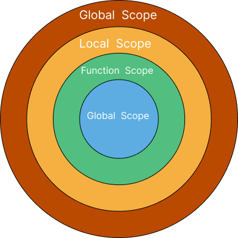
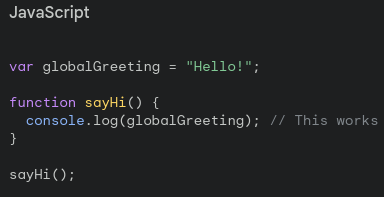
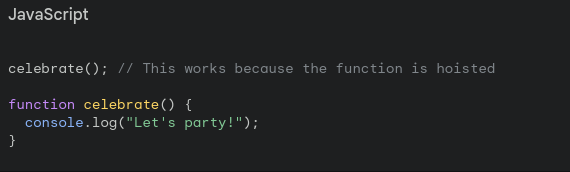
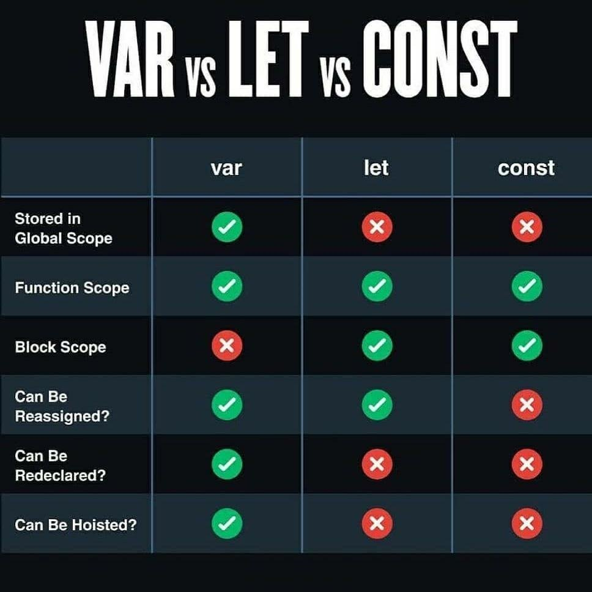
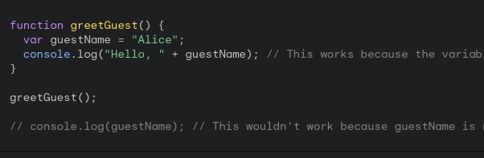
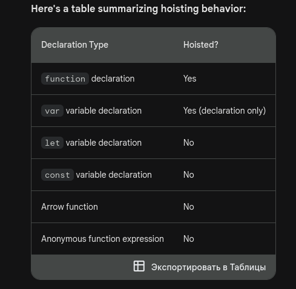

*In JavaScript, hoisting and scope are two fundamental concepts that govern how variables and functions behave in your code.*
#### In JavaScript, hoisting refers to the behavior of moving variable and function declarations to the top of their containing scope during the compilation phase. Here's a detailed breakdown of hoisting for different types of declarations and functions:
- 1.var, let, and const declarations:

> [!WARNING]
>Hoisting: All var, let, and const declarations are hoisted to the top of their containing scope (global, function, or block scope).
> [!WARNING]
>Initialization: However, the initialization of variables (assignment to a value) is not hoisted. The variables are accessible but uninitialized until their initialization code is executed.
> [!WARNING]
>Temporal Dead Zone (TDZ): For let and const, there's a "temporal dead zone" between the declaration and initialization where the variables cannot be accessed. Accessing them in this zone results in a ReferenceError.


- [x] 2.Function declarations:
> [!TIP]
>Hoisting: Function declarations are hoisted to the top of their containing scope.
Function expressions and arrow functions: These are not hoisted like function declarations. They are only hoisted if they are assigned to a variable or declared within a block scope.
- [x] 3.Immediately Invoked Function Expressions (IIFE):
> [!IMPORTANT]
> Hoisting: IIFEs are hoisted to the top of their containing scope, but they are executed immediately when the script is loaded, so they don't interfere with other code above them.
- [x] 4.Scoping:
>~~Global scope~~: Variables and functions declared outside any function or block have global scope and are accessible from anywhere in your code.Local scope: Variables and functions declared inside a function or block have local scope and are only accessible within that function or block.Block scope: Introduced with let and const, block scope limits variable and function accessibility to the block they are declared in (e.g., loops, conditionals).
``` bash
let globalVar = "I'm a global variable.";

function exampleFunction() {
  let localVar = "I'm a local variable.";
  console.log(globalVar); // Output: I'm a global variable.
  console.log(localVar); // Output: I'm a local variable.
}

exampleFunction();
console.log(globalVar); // Output: I'm a global variable.
console.log(localVar); // ReferenceError: localVar is not defined
```
#### here is the example of global scope 


@as777ms :+1: This PR looks great - it's ready to merge! :shipit:
# _Hoisting_
1.Variables (var, let, const):
Variables declared with ~~var~~ are hoisted to the top of their containing scope during the compilation phase. However, their initialization remains in place.
>Variables declared with `~~let~~ and ~~const~~` are also **hoisted** to the top of their containing scope, but they remain in the **"temporal dead zone"** until their actual declaration is encountered during execution. Accessing them before declaration results in a ReferenceError.
2.Function Declarations:

`Function declarations` are fully hoisted. This means that the entire function definition, including the name and body, is moved to the top of its containing scope during the compilation phase. Therefore, you can call a function before its actual declaration in the code.
#### here is the picture of the example


### 3.Function Expressions *(including Arrow Functions and Anonymous Functions)*:
`Function expressions` are not `hoisted` in the same way as function declarations. Only the variable declaration (if any) is hoisted, not the function assignment. So, if you define a function using a function expression ~~(including arrow functions and anonymous functions)~~ and try to call it before its declaration, you'll encounter a `TypeError or ReferenceError`, depending on how you're trying to access it.

>#### IIFE (Immediately Invoked Function Expressions):
>IIFEs are a common pattern in JavaScript where a function is defined and immediately invoked. When using an IIFE, only the function declaration part is hoisted, while the invocation is not. So, trying to call an IIFE before its declaration will result in a ReferenceError.

___________________________________________

# Scope:

#### Global Scope:
`Variables`
``` diff
-and functions declared outside of any function have global scope, meaning they are accessible from anywhere in the code.
```

#### Function Scope:
```diff
-Variables declared inside a function using var have function scope, meaning they are accessible only within that function. This is true for both regular functions and IIFEs.
```
#### Block Scope (with let and const):
`Variables declared with let and const have block scope, meaning they are only accessible within the block (enclosed by curly braces) in which they are defined. This includes loops (for, while, etc.) and conditional statements (if, switch, etc.).`

#### here are some examples
``` bash
var globalVar = 'I am global';
function foo() {
    var localVar = 'I am local';
    console.log(globalVar); // accessible
    console.log(localVar);  // accessible
}
foo();
console.log(globalVar); // accessible
console.log(localVar);  // ReferenceError: localVar is not defined
```
>it will show underfined in the  if we create `var` and write console.log in the top and call it it will hoist but show underfined
```
console.log(x); // Output: undefined
var x = 10;
```

```
let globalVar = "I'm a global variable.";

function exampleFunction() {
  let localVar = "I'm a local variable.";
  console.log(globalVar); // Output: I'm a global variable.
  console.log(localVar); // Output: I'm a local variable.
}

exampleFunction();
console.log(globalVar); // Output: I'm a global variable.
console.log(localVar); // ReferenceError: localVar is not defined
```
# Local Scope
#### Functions create their own smaller party spaces. Variables and functions inside a function are only accessible within that function.


# Variables with var 
#### Variables with var are like empty tables. You can mention them (reference them) before setting them up, but they'll be empty (undefined) until you add decorations (assignment).As i said in the top if this message it will hoist but will show underfined
``` javascript
console.log(message); // This outputs "undefined" because the variable is hoisted but not assigned

var message = "Welcome!";
```

#### here is the table of hoisting
